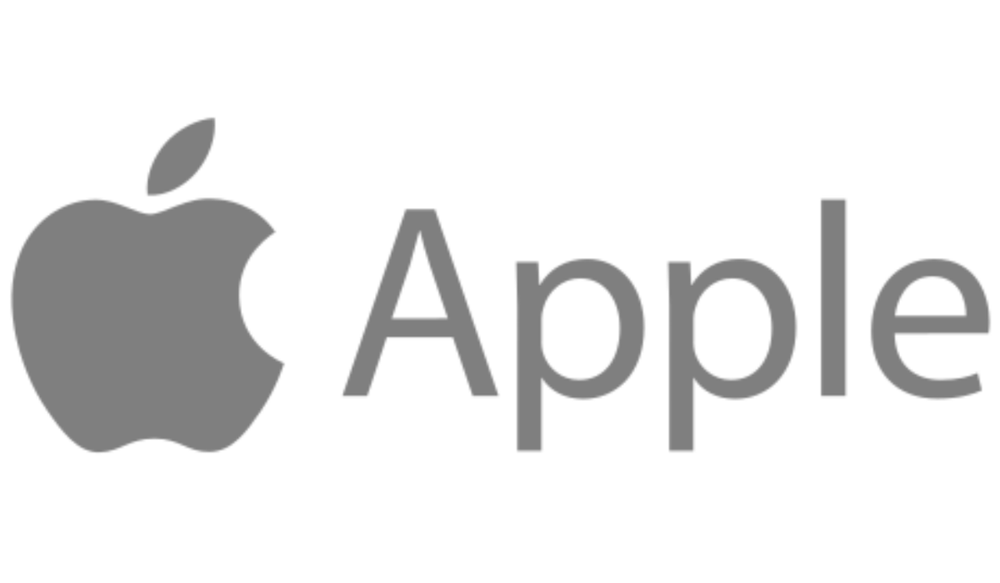
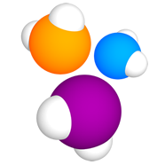
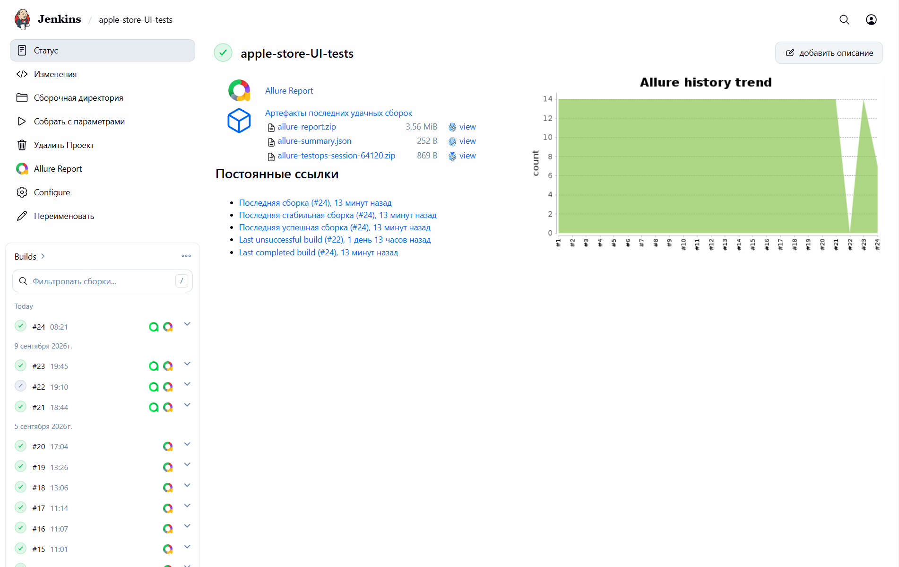
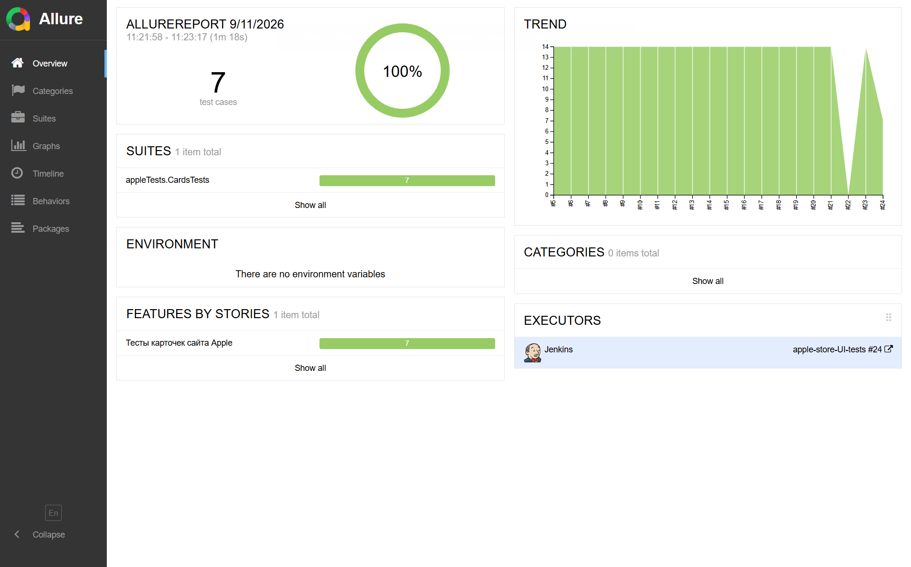
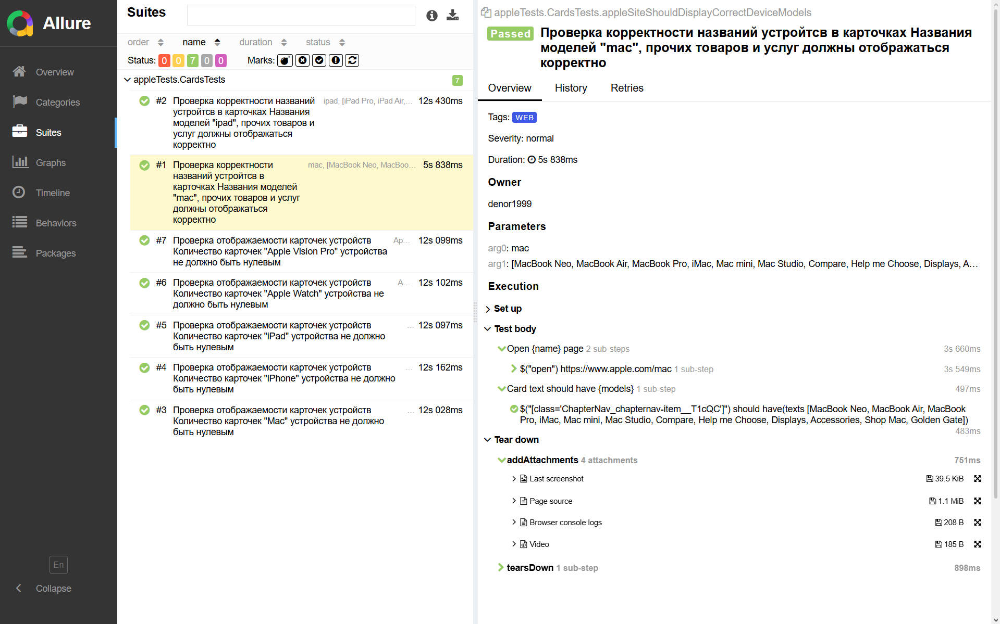
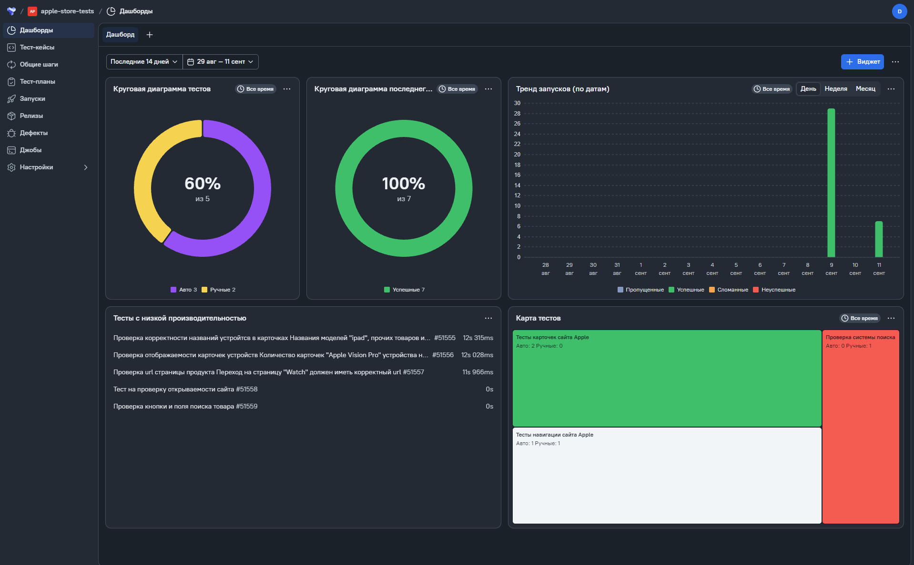
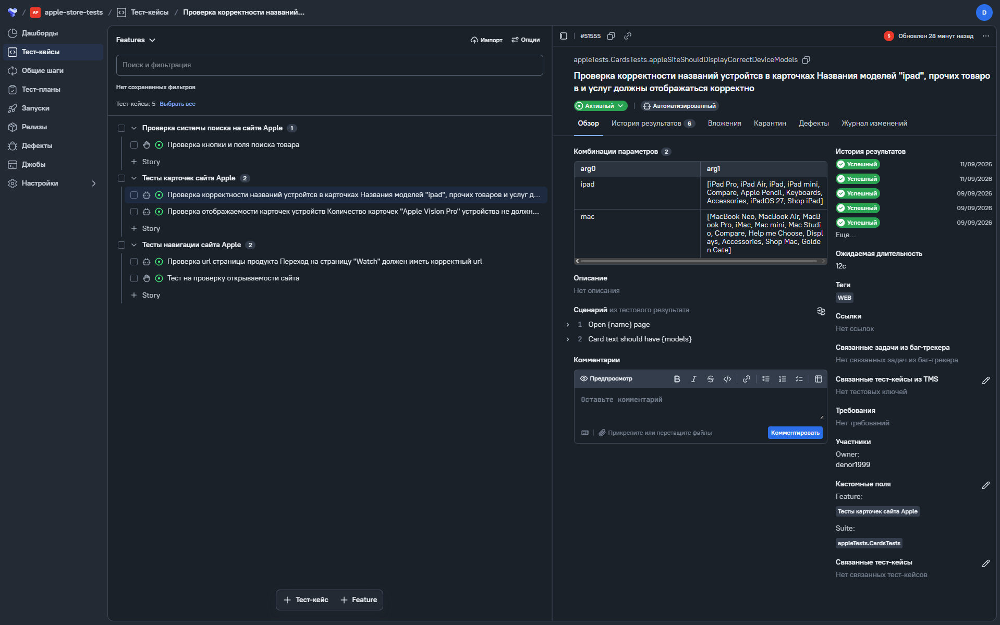
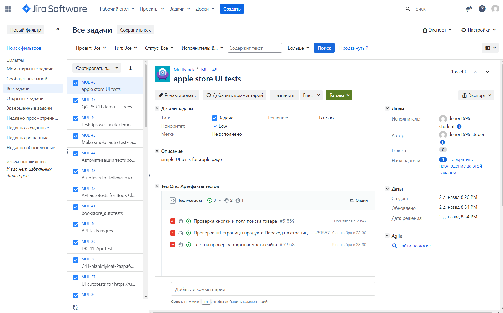
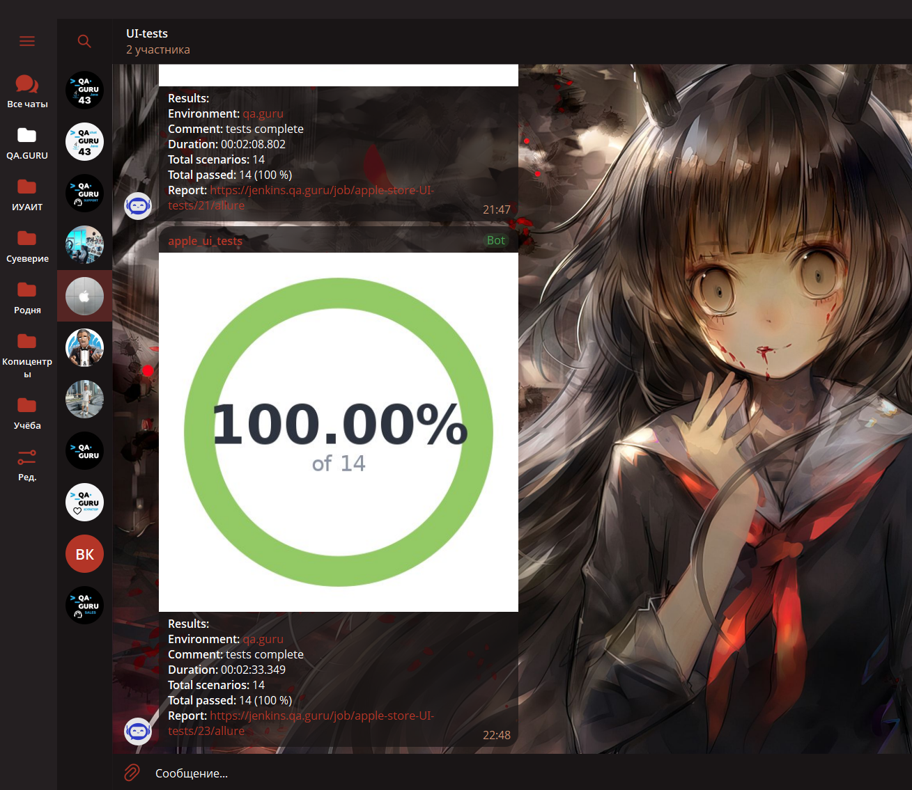

# Проект по автоматизации UI тестов для сайта [Apple](https://www.apple.com/)
<a href="https://www.apple.com/"></a>

## Структура

---

- <a href="#-технологии-и-инструменты">Стек</a>
- <a href="#-проведенные-автотесты">Проведенные автотесты</a>
- <a href="#-сборка-в-jenkins">Сборка в Jenkins</a>
- <a href="#-запуск-из-терминала">Запуск из терминала</a>
- <a href="#-Allure-отчет">Allure отчет</a>
- <a href="#-интеграция-с-Allure-TestOps">Интеграция с Allure TestOps</a>
- <a href="#-интеграция-с-jira">Интеграция с Jira</a>
- <a href="#-отчет-в-telegram">Отчет в Telegram</a>
- <a href="#-пример-запуска-автотеста">Видео пример запуска автотеста</a>

## 🛠️ Стек

---

<p align="center">





</p>

## ✅ Проведенные автотесты

---

### Тесты навигации сайта Apple:

- Параметризованный тест, проверяющий корректность url при перемещении по сайту
    - Store
    - Mac
    - iPad
    - iPhone
    - Watch
    - Vision
    - AirPods
- Параметризованный тест, проверяющий отображаемость карточек устройств на сайте
  - Mac
  - iPhone
  - iPad
  - Apple Watch
  - Apple Vision Pro

## 📋 Сборка в [Jenkins](https://jenkins.qa.guru/job/apple-store-UI-tests/)

---



### Параметры сборки в Jenkins
Сборка в Jenkins включает в себя только один параметр, отвечающий за интеграцию с Allure TestOps

При запуске тестов из Allure TestOps это параметр подставляется автоматически


## ▶️ Запуск из терминала

---

### Локальный запуск:
```
gradle clean test
```

### Удалённый запуск:
```
clean test
```

## 📑 [Allure отчет](https://jenkins.qa.guru/job/apple-store-UI-tests/24/allure/)

---

### Главный экран отчета


### Страница с проведенными тестами



## 📑 Интеграция с [Allure TestOps](https://allure.qa.guru/project/5376/dashboards/5682)

---

### Экран с результатами тестов


### Страница с тестами в Allure TestOps



## 📑 Интеграция с [Jira](https://jira.qa.guru/browse/MUL-48)

---

### Страница с описанием задачи в Jira



## 💬 Отчет в Telegram

---



---

## 🎦 Пример запуска автотеста
> К каждому тесту в отчете прилагается видео.

